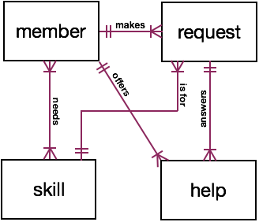

# helpshare

Database-backed API supporting cooperative help management.

## Project Members

[Jonathan Pool](https://github.com/jrpool)

## Discussion

### Requirement Summary

This application addresses the following imaginary requirements:

Our on-site community has about 100 members. Each member has at least 1 role. Members in the learner role (“learners”) are also in 1 of 5 phases.

Learners seek to master about 400 skills. Each skill is in at least 1 domain.

By design, all learners both learn and help others learn. Members can request help and respond to requests by offering help.

An application that supports the efficient matching of requests and offers and collects data on the learning and helping processes may make the community more effective.

### Requirement Details

Version 0 will be an API only. It will make the following things true:

0. Members with role “manager” can add and amend members, phases, and roles.

1. Members with role “expert” can add and amend skills and domains.

2. Learners can add and delete claims that they have mastered skills.

3. Learners can open and close help requests. Each request specifies the skill on which help is requested and the learner’s location on the site. Members with role “manager” can add and amend locations. Each request optionally also includes a comment. Its maker can amend a request’s location and/or its comment.

4. Members other than makers of requests can open and close help offers for requests while open. The closing of a request closes all open offers for it.

5. Members can create and amend assessments of offers (and thus of the requests for that the offers are for). Each assessment contains a rating and optionally a comment. Members with role “manager” can add and amend permitted ratings.

6. Events are logged.

7. All members can see the following facts:

```
I. ENTITIES

A. Members:
a. ID.
b. Name.
c. Handle.
d. Phase.

B. Phases:
a. ID.
b. Description.

C. Roles:
a. ID.
b. Description.

D. Skills:
a. ID.
b. Description.

E. Domains:
a. ID.
b. Description.

F. Roleplays:
a. ID.
b. Member.
c. Role.

F. Masteries:
a. ID.
b. Member.
c. Skill.

F. Relevances:
a. ID.
b. Skill.
c. Domain.

G. Locations:
a. ID.
b. Description.

H. Ratings:
a. ID.
b. Description.

II. EVENTS

A. Requests:
a. ID.
b. Skill.
c. Member.
d. Location.
e. Comment.
f. When opened.
g. When closed.

B. Offers:
a. ID.
b. Request.
c. Maker.
d. When opened.
e. When closed.

C. Assessments:
a. ID.
b. Offer.
c. Assessor.
d. Rating.
e. Comment.

D. Event log:
a. ID.
b. When occurred.
c. Maker.
d. Genre.
e. Content.
f. Addendum.

III. OPTIONAL REPORTS

Reports combining and summarizing the above facts.
```

8. Each request to the API identifies a member as the maker of the request. The API trusts the authenticity of that member.

### Future Requirements

Future versions may include the following additional features:

```
- A web interface to the API.
- Authentication of requests.
- Notifications to members who have mastered skills for which help requests have been opened.
- Suspension of help requests during times when requesters are unavailable.
- Implementation of an on-call role.
- Addition of modules (study units) as entities, with associated skills.
- Addition of member groups as entities capable of making help requests.
- Automatic termination of requests determined to be stale.
- Role-based limitations of visibilities of some facts and events.
```

## Implementation

The above requirements are modeled in a database whose schema is summarized and diagrammed below.




### Project Origin

This application was created in fulfillment of the requirements of the “Pizza Restaurant: RDB Schema with CRUD API” module (Module 98) in Phase 3 of the [Learners Guild][lg] curriculum.

As the module’s title suggests, the requirement is to model aspects of a pizza restaurant and develop a database and API to satisfy a set of specifications related to such an operation.

However, the module also states, “Please feel free to adapt the content of the data to your personal preferences or adjust your schema to support any other data types or operations you can think of. Get creative!” The above requirements were adopted under the license granted by that statement.

## Installation and Configuration

0. These instructions presuppose that (1) [npm][npm] and [PostgreSQL][pg] are installed, (2) there is a PostgreSQL database cluster, (3) PostgreSQL is running, and (4) when you connect to the cluster you are a PostgreSQL superuser.

1. Your copy of this project will be located in its own directory, inside some other directory that you may choose or create. For example, to create that parent directory inside your own home directory’s `Documents` subdirectory and call it `projects`, you can execute:

    `mkdir ~/Documents/projects`

Make that parent directory your working directory, by executing, for example:

    `cd ~/Documents/projects`

2. Clone this project’s repository into it, thereby creating the project directory, named `helpshare`, by executing:

    `git clone https://github.com/jrpool/helpshare.git helpshare`

3. Make the project directory your working directory by executing:

    `cd helpshare`

4. Install required dependencies (you can see them listed in `package.json`) by executing:

    `npm i`

5. To create the database, execute `npm run db_reset`.

6. To equip it with the schema, execute `npm run schema_reset`.

7. To seed it with the minimal required data to permit the API to fulfill requests, execute `npm run miniseed`.

8. After minimally seeding it, to further seed it with a sample of additional imaginary data, execute `npm run sampleseed`.

8. To start the application, execute `npm start`.

9. To access the API while it is running, issue HTTP requests to `http://localhost:3000` as specified below:

| Method |         URL        |        Body properties [optional]       |
| ------ | ------------------ | --------------------------------------- |
| POST   | `/members`         | `fullname`, `handle`, `[phase]`         |
| POST   | `/roles/grant`     | `member`, `role`                        |
| POST   | `/roles`           | `description`                           |

(in progress)

[lg]: https://www.learnersguild.org
[npm]: https://www.npmjs.com/
[pg]: https://www.postgresql.org/
