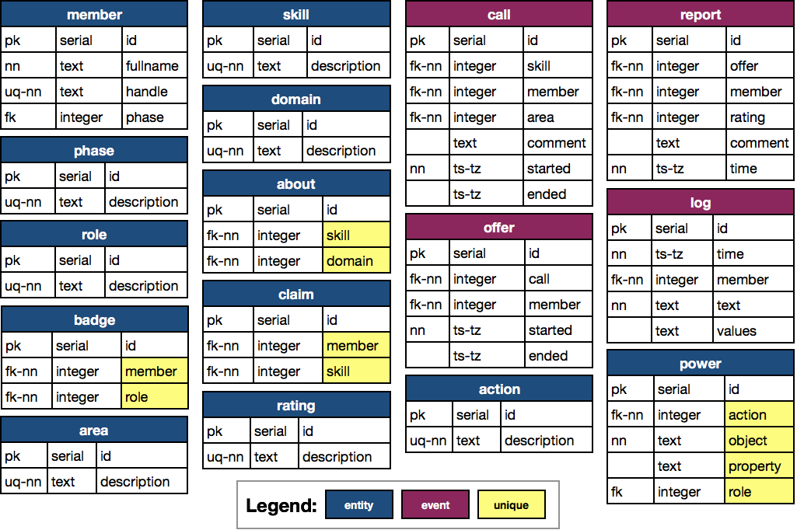
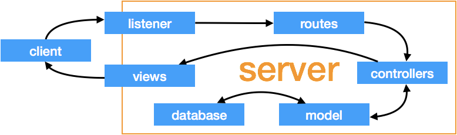

# helpshare

Database-backed API supporting cooperative help management.

## Project Members

[Jonathan Pool](https://github.com/jrpool)

## Use Case

This application addresses the following imaginary use case:

Our on-site community has about 100 members, identified by name and unique handle. Each member has at least 1 role, drawn from the set {learner, expert, manager}. Learners are also in 1 of 5 phases {1, 2, 3, 4, 5}.

Members seek to master skills, drawn from a set of about 400. Each skill is in at least 1 domain, drawn from a set of about 30.

A member can claim competence in any skill and can also withdraw any claim.

A member can call for help on any skill. A call includes the skill on which help is sought, the current location of the member, and optionally a comment.

A member can respond to any call with an offer of help.

The transaction arising from any call and any offer responding to that call can be assessed. The assessment includes a rating, drawn from a set of permitted ratings, and optionally a comment.

Powers to create, delete, update, and read things are granted in two ways. In a grant by role, they are granted to all members with a specified role. In a grant by relation, they are granted to any member with respect to things specific to that member.

Events (calls, offers, and assessments) have timestamps. Calls and offers can be closed, and when closed they acquire timestamps indicating when closed.

Changes to records are logged. Log entries indicate which members caused the changes, what the changes were, and when they took place.

The application will include a service and application and user interfaces to it. The initial installment (“version 0”) will consist solely of an API. Each request to the API must identify the member making the request. In version 0, the API may trust the request, including its identification of its maker, to be authentic.

## Future Use Cases

Future versions may be required to include the following additional features:

```
- A web interface to the API.
- Authentication of requests.
- Notifications to members who have skills that other members call for help on.
- Suspension of help requests during times when requesters are unavailable.
- Implementation of an on-call role.
- Addition of modules (study units) as entities, with associated skills.
- Addition of member groups as entities capable of making help requests.
- Automatic termination of requests determined to be stale.
```

## Implementation

### Schema

The above requirements are modeled in a database whose schema is summarized and diagrammed below.

<p align='center'></p>

<p align='center'></p>

### Interaction Architecture

The application models the interaction between clients and data as follows:

<p align='center'></p>

In this architecture, a client interacts with the server only via a listener and views. A listener transmits a client’s request without evaluation to a router, which chooses the appropriate route. The code for that route evaluates the request enough to assign it to the appropriate controller. That controller subjects the request to some validation (i.e. validation not requiring knowledge of the model). If it finds the request invalid, the controller chooses a view and instructs that view to notify the client. If valid, the controller tells the model what operation should (in principle) be performed. The model further validates the proposed operation. If invalid, the model informs the controller, which chooses and instructs a view. If valid, the model performs the operation, sending queries to the database as needed, and returns a result to the controller, which chooses a view and instructs it to send the appropriate content to the client. In executing a controller’s instructions, a view can make required transformations of content and format, such as providing natural-language messages in various languages or choosing between JSON and HTML output as required by the client.

Views are organized by a combination of request type and affected object. For example, there is a view for updating a report. However, in the interest of parsimony, code in the routes, controllers, model, and database is organized by request or operation type. For example, a route, a controller, a model function, and a database function for updates exist. They can process updates on anything. The reason is that in this application there is substantial parallelism across object types, allowing a single function to perform an operation on any object, by looking up object-specific information and applying a uniform procedure to it.

## Project Origin

This application was created in fulfillment of the requirements of the “Pizza Restaurant: RDB Schema with CRUD API” module (Module 98) in Phase 3 of the [Learners Guild][lg] curriculum.

As the module’s title suggests, the requirement is to model aspects of a pizza restaurant and develop a database and API to satisfy a set of specifications related to such an operation.

However, the module also states, “Please feel free to adapt the content of the data to your personal preferences or adjust your schema to support any other data types or operations you can think of. Get creative!” The above requirements were adopted under the license granted by that statement.

## Installation and Configuration

0. These instructions presuppose that (1) [npm][npm] and [PostgreSQL][pg] are installed, (2) there is a PostgreSQL database cluster, (3) PostgreSQL is running, and (4) when you connect to the cluster you are a PostgreSQL superuser.

1. Your copy of this project will be located in its own directory, inside some other directory that you may choose or create. For example, to create that parent directory inside your own home directory’s `Documents` subdirectory and call it `projects`, you can execute:

    `mkdir ~/Documents/projects`

Make that parent directory your working directory, by executing, for example:

    `cd ~/Documents/projects`

2. Clone this project’s repository into it, thereby creating the project directory, named `helpshare`, by executing:

    `git clone https://github.com/jrpool/helpshare.git helpshare`

3. Make the project directory your working directory by executing:

    `cd helpshare`

4. Install required dependencies (you can see them listed in `package.json`) by executing:

    `npm i`

5. To create the database, execute `npm run db_reset`.

6. To equip it with the schema, execute `npm run schema_reset`.

7. To seed it with the minimal required data to permit the API to fulfill requests, execute `npm run miniseed`.

8. To start the application, execute `npm start`.

9. After minimally seeding the database and starting the application, to further seed the database with a sample of additional imaginary data, execute `npm run sampleseed`.

10. To access the API while it is running, issue HTTP requests to `http://localhost:3000` as specified below:

| Method |         URL        | Required and [optional] body properties |
| ------ | ------------------ | --------------------------------------- |
| POST   | `/members`         | `fullname`, `handle`, `[phase]`         |
| POST   | `/roles/grant`     | `member`, `role`                        |
| POST   | `/roles`           | `description`                           |

(in progress)

[lg]: https://www.learnersguild.org
[npm]: https://www.npmjs.com/
[pg]: https://www.postgresql.org/
